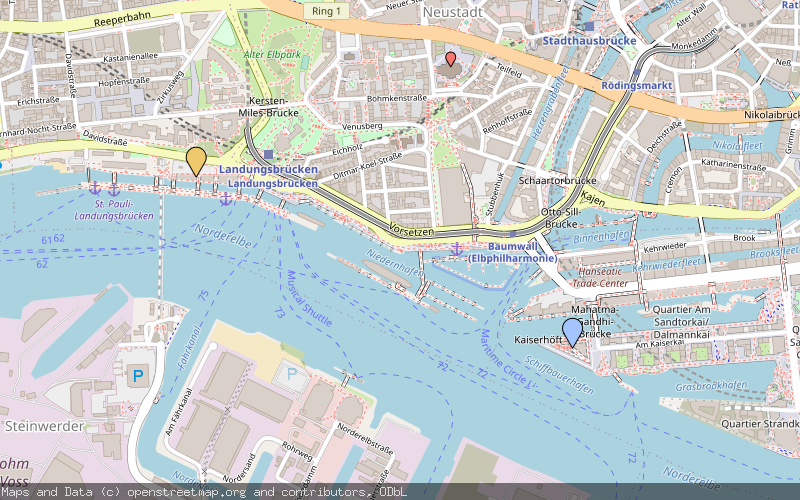

[](https://goreportcard.com/report/github.com/Luzifer/staticmap)


# Luzifer / staticmap

`staticmap` is a webserver written in Go to generate static maps from [OpenStreetMap](https://openstreetmap.org/) tiles. Its API is inspired by the [Google Static Maps API](https://developers.google.com/maps/documentation/static-maps/intro) but supports only a subset of the functions and parameters described there.

## API

All map operations are made against the `/map.png` endpoint of the server and are controlled by parameters:

| Parameter | Description |
| ---- | ---- |
| `center` | (required) Describes where to center the map. Must be given in decimal coordinates in format `lat,lon` (eg. `62.107733,-145.541936`) |
| `zoom` | (required) Describes the zoom level of the map. Must be a number between 1 and 16 like in the OpenStreetMap itself |
| `size` | (required) Output format of the requested map. Must be two numbers joined by an `x` (eg. `600x300`) - By default there is a limit to 1024px on each edge, you can set this in the parameters of the server. |
| `markers` | (optional) Marker definition, supports `size` and `color` attribute and marker positions must be given in format `lat,lon`. Elements of the marker definition are joined by a vertical bar. Valid sizes are `tiny, mid, small`. Valid colors are `black, brown, green, purple, yellow, blue, gray, orange, red, white` or a hex color in 3 or 6 letter notation: `0x333, 0x333333`. |

### Example of a map having two different markers

```
/map.png
    ?center=53.5438,9.9768
    &zoom=15
    &size=800x500
    &markers=color:blue|53.54129165,9.98420576699353
    &markers=color:yellow|53.54565525,9.9680555636958
```

The map center is set to a coordinate within Hamburg, Germany with a zoom level of 15. Additionally there are two markers set: One `blue` marker to the Elbphilharmonie, one `yellow` marker to the Hard Rock Cafe Hamburg. The example above (of course without the line breaks) produced this image:



### Overlay support

Starting with version `v0.4.0` the generator supports map overlays for tiles based on transparent background (like [OpenFireMap](http://openfiremap.org/), [OpenSeaMap](http://www.openseamap.org/), ...). As those requests would be too complex for `GET` requests and are also not a common usecase they are implemented as `POST` requests containing a JSON object.

This example is generated with [OpenFireMap](http://openfiremap.org/) overlay tiles using the [`example/postmap.json`](example/postmap.json) file:


## Setup

- There is a Docker container available: [`luzifer/staticmap`](https://hub.docker.com/r/luzifer/staticmap/)
- This repository has precompiled binaries attached in the [releases](https://github.com/Luzifer/staticmap/releases) section
- You can `go get github.com/Luzifer/staticmap` the project and build it from source

Afterwards just see `staticmap --help` (or `docker run --rm -ti luzifer/staticmap --help`) for commandline parameters.

----


